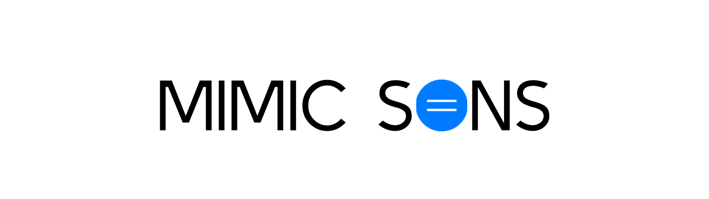

# Mimic Sons

> O jogo "Mimic Sons" é uma divertida competição em que os jogadores se revezam imitando diferentes sons, enquanto os demais tentam adivinhar. O design apresenta uma interface simples e agradável, com recursos como gravação de áudio, desafios aleatórios e uma experiência interativa entre os participantes. 

### Ajustes e melhorias

O projeto está em desenvolvimento. Próximas atualizações serão voltadas nas seguintes tarefas:

- [ ] Adição de um sistema de votação
- [ ] Pódio local
- [ ] Tela de vencedor
- [ ] Jogabilidade virtual
- [ ] Tela de treino e manual de instruções

## 🚨 Importante

Antes de começar, verifique se você atendeu aos seguintes requisitos:

- Jogo na versão versão Web.
- Leia: `Manual de Instruções`.

## 🚀 Jogando

Para jogar o Mimic Sons, acesse:

- https://itscaiocunha.github.io/MimicSons/

## 📫 Contribuindo para MimicSons

Para contribuir, siga estas etapas:

1. Bifurque este repositório.
2. Crie um branch: `git checkout -b <nome_branch>`.
3. Faça suas alterações e confirme-as: `git commit -m '<mensagem_commit>'`
4. Envie para o branch original: `git push origin <nome_do_projeto> / <local>`
5. Crie a solicitação de pull.

Como alternativa, consulte a documentação do GitHub em [como criar uma solicitação pull](https://help.github.com/en/github/collaborating-with-issues-and-pull-requests/creating-a-pull-request).

## 🤝 Colaboradores

Agradecemos às seguintes pessoas que contribuíram para este projeto:

<table>
  <tr>
    <td align="center">
      <a href="https://github.com/itscaiocunha" title="Caio Cunha">
         
        
          <b>Caio Cunha</b>
        
      </a>
    </td>
</table>

## 😄 Seja um dos contribuidores

Quer fazer parte desse projeto? Me chame em alguma rede social minha:
  - Instagram: @itscaiocunha
  - Twitter: @itscaiocunha
  - LinkedIn: https://www.linkedin.com/in/caio-grilo-da-cunha-05ba14240/

## 📝 Licença

Esse projeto está sob licença. Veja o arquivo [LICENÇA](LICENSE.md) para mais detalhes.
